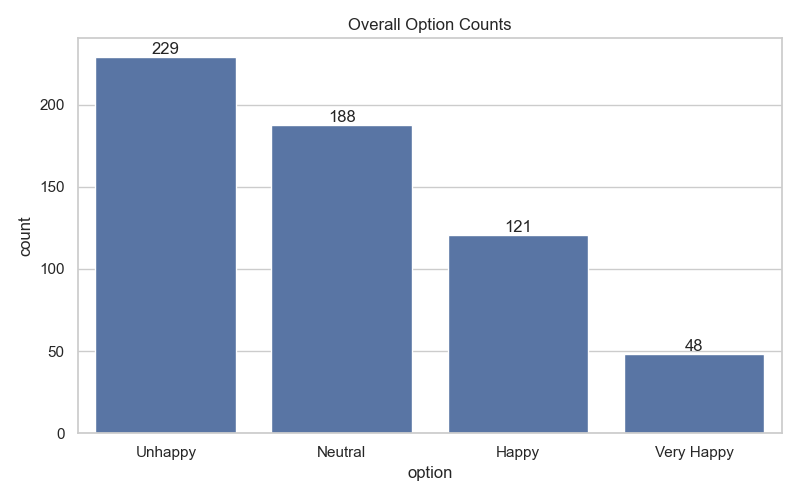
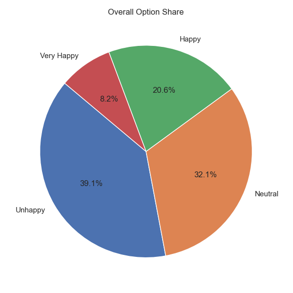
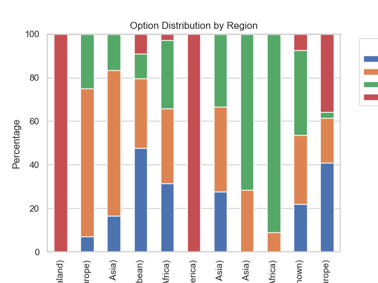

# 📊 Poll Results Visualizer

## 🚀 Overview

Poll Results Visualizer is a complete data analysis and visualization project that transforms raw survey or poll data into meaningful insights using Python.

It supports CSV datasets (Google Forms exports, public datasets, or synthetic data) and generates clear visualizations along with automated insights and an interactive dashboard.

---

## 🎯 Problem Statement

Raw survey data is often unstructured and difficult to interpret. Organizations need a system to:

* Clean and preprocess poll data
* Analyze responses efficiently
* Visualize trends and distributions
* Generate actionable insights

---

## 💡 Solution

This project builds an end-to-end pipeline:

1. Data ingestion (CSV / synthetic / public datasets)
2. Data cleaning and preprocessing
3. Analytical computations (counts, percentages, comparisons)
4. Visualization (bar, pie, stacked charts)
5. Insight generation
6. Interactive dashboard using Streamlit

---

## 🛠️ Tech Stack

* **Language:** Python
* **Libraries:** pandas, numpy
* **Visualization:** matplotlib, seaborn
* **Dashboard:** Streamlit

---

## 📂 Project Structure

```
Poll-Results-Visualizer/
│
├── data/
├── src/
├── outputs/
├── images/
├── main.py
├── streamlit_app.py
├── requirements.txt
└── README.md
```

---

## ▶️ How to Run

### 1️⃣ Install dependencies

```
pip install -r requirements.txt
```

### 2️⃣ Run pipeline

```
python main.py
```

### 3️⃣ Run dashboard

```
streamlit run streamlit_app.py
```

---

## 📊 Poll Results (Key Findings)

* **Total Responses:** 586
* **Top Category:** Very Happy
* **Majority Trend:** Most responses fall under *Happy* and *Very Happy*
* **Least Category:** Unhappy

### 🌍 Regional Insights

* Some regions show a higher concentration of **Very Happy** responses
* Others lean towards **Neutral** or **Happy**
* Clear variation in satisfaction across regions

### 🧠 Observations

* Global happiness distribution is positively skewed
* Very few responses fall into negative categories
* Regional comparison highlights differences in well-being

---

## 📈 Visual Results

### 📊 Overall Distribution (Bar Chart)



---

### 🥧 Percentage Share (Pie Chart)



---

### 🌍 Region-wise Comparison (Stacked Chart)



---

## 📊 Generated Outputs

The project generates:

* `cleaned_data.csv` → Processed dataset
* `summary_table.csv` → Counts & percentages
* `region_pivot.csv` → Region-wise analysis
* `insights.txt` → Auto-generated insights
* Charts → Saved in `outputs/`

---

## ⚙️ Features

* Data cleaning with robust handling of missing columns
* Option-wise vote/share analysis
* Region-wise comparison
* Automated insights generation
* Interactive Streamlit dashboard
* Modular and scalable structure

---

## 🧠 Key Learnings

* Handling real-world messy datasets
* Building fault-tolerant pipelines
* Data transformation and aggregation
* Visualization for decision-making
* Dashboard development

---

## 💼 Use Cases

* Election poll analysis
* Customer feedback surveys
* Employee satisfaction analysis
* Product preference analysis
* Academic surveys

---

## 🚀 Future Improvements

* Real-time polling integration
* Advanced filtering (region, demographics)
* Sentiment analysis
* Cloud deployment (Streamlit Cloud / AWS)
* Power BI / Tableau integration

---

## 👨‍💻 Author

**Bharath B R**

---

## ⭐ If you like this project, give it a star!
